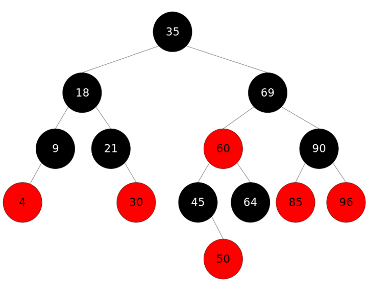
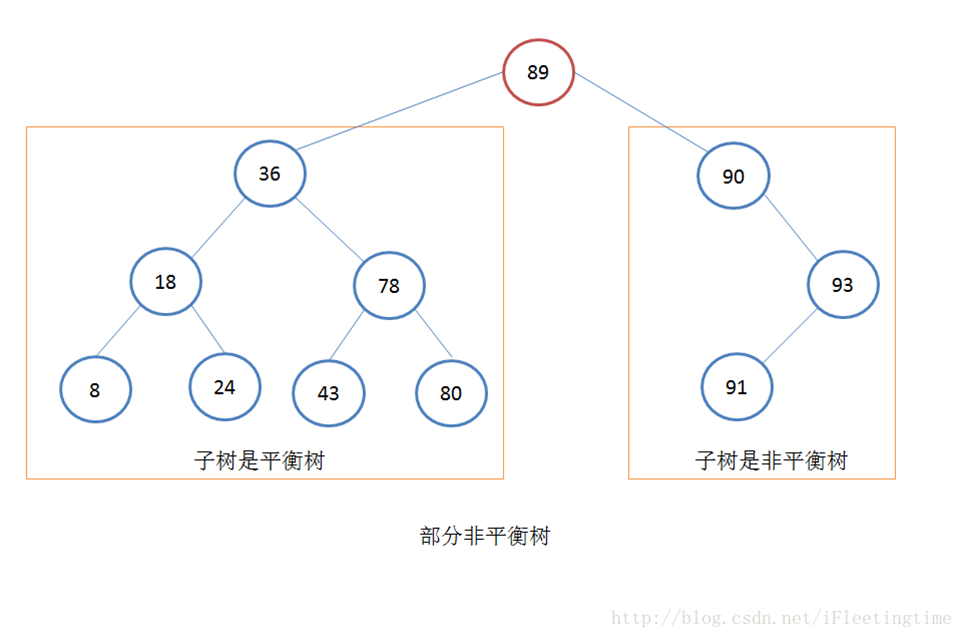
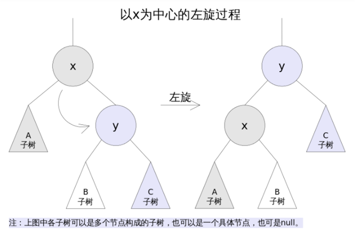
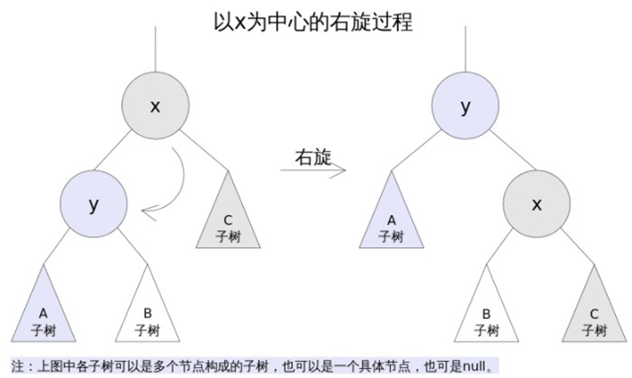
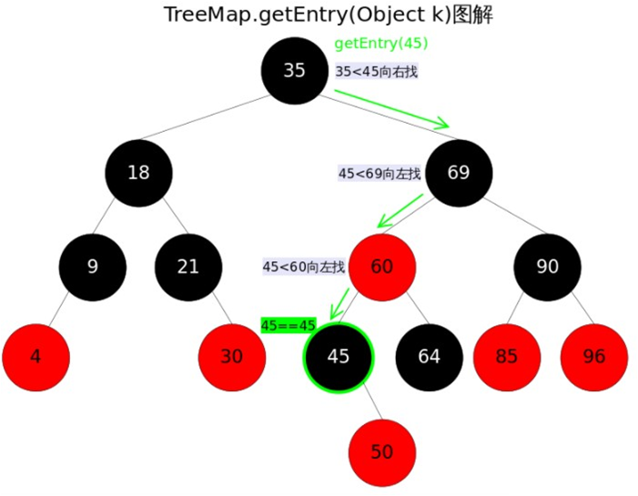
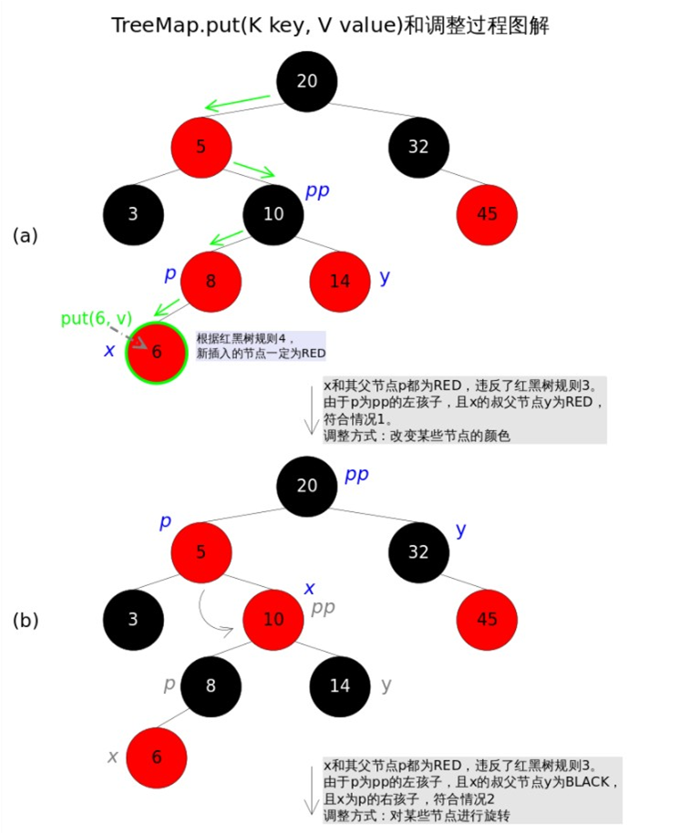
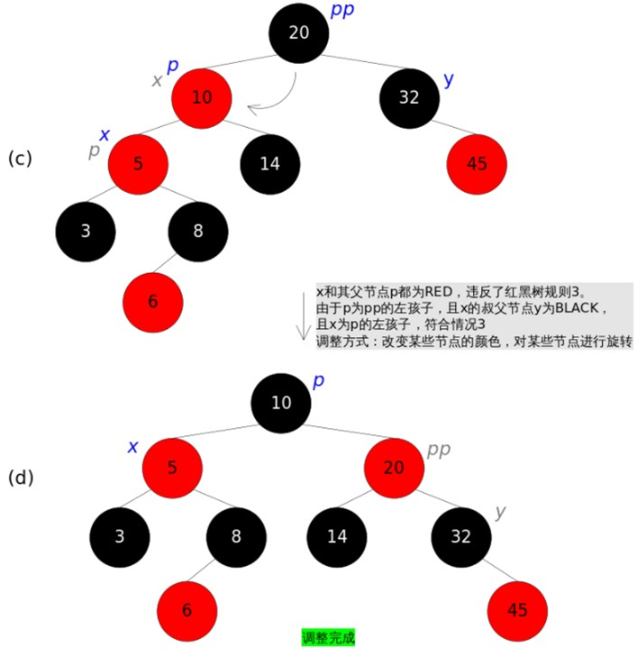
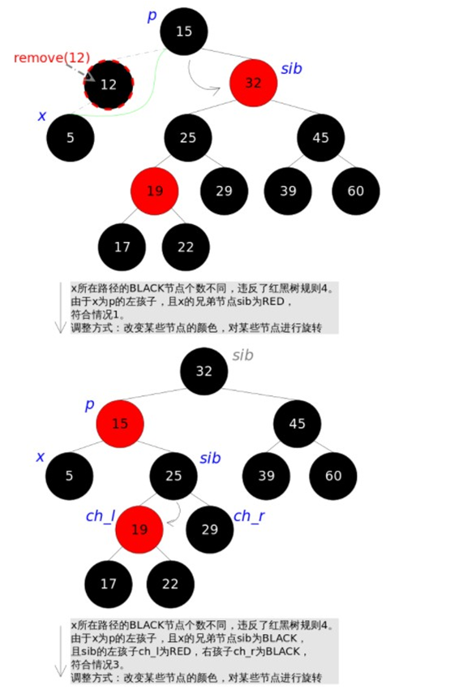
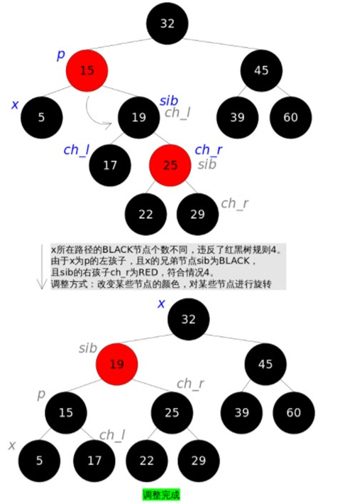

### 红黑树



* 二叉树的缺点:  
二叉树搜索有一个很麻烦的问题：如果树中插入的是随机数据，那么二叉树的执行效果会非常好。但是，如果插入的是有序数据，如1,2,3,4… 那么二叉树的执行速度就会非常的慢。因为当插入的数据是有序的话，二叉树就是非平衡的了（只有左子树或者只有右子树）。而对于非平衡树，他的快速查找指定数据项的能力就丧失了。对于随机数据的实际数量来说，一颗树特别不平衡的情况是不大可能的，毕竟是随机插入的。但是，可能会有一小部分有序数据使得部分子树非平衡。对于树的搜索效率来说，非平衡树的搜索时间位于O(N) 和 O（logN）之间，这取决于树的不平衡程度





* 平衡的补救:  
为了能以比较快的时间O（logN）来搜索一棵树，需要保证树总是平衡的（或者至少大部分是平衡的）。这就是说树中的每个节点在它左边的后代数量和在右边的后代数量应该大致相等。红-黑树的平衡是在插入和删除的过程中取得的，对一个要插入的数据项，插入需要检查不会破坏树一定的特征。如果破坏了，程序就会进行纠正，根据需要更改树的结构。 通过这个办法，维持了树的特征，保持了树的平衡。


* 红黑树的特征:   
``` 
1.节点都有颜色:  
在红黑树中，每一个节点要么是黑色的，要么是红色的。实际上，所说的节点有颜色，是一种比方，颜色只是为了标记。在书写代码的过程中可以定义一个 boolean形式的属性如 isRed。以此属性来表示颜色的信息。 
2.在插入和删除过程中，要遵循保持这些颜色的不同排列的规则:  
当插入和删除一个节点是，必须要遵循一定的规则，即红-黑规则，如果遵循这些规则，树就是平衡的。
规则1 ：每一个节点都是有颜色的，非黑即红
规则2 ：根总是黑色的
规则3 ：如果节点是红色的，则它的子节点必须是黑色的（反之，不一定）
规则4 ：从根到叶节点或空子节点的每条路径，必须包含相同数目的黑色节点。
```

* 红黑树如何修正违规:  
改变节点的颜色  
执行旋转操作, 一次旋转能够使树更加趋于平衡。


* 结构调整 – 左旋:  
左旋的过程是将x的右子树绕x逆时针旋转，使得x的右子树成为x的父亲，同时修改相关节点的引用。旋转之后，二叉查找树的属性仍然满足。




* 结构调整 – 右旋:  
右旋的过程是将x的左子树绕x顺时针旋转，使得x的左子树成为x的父亲，同时修改相关节点的引用。旋转之后，二叉查找树的属性仍然满足



java->Treemap相关方法与红黑树的实现:
* get(Object key)方法根据指定的key值返回对应的value，该方法调用了getEntry(Object key)得到相应的entry，然后返回entry.value。因此getEntry()是算法的核心。算法思想是根据key的自然顺序（或者比较器顺序）对二叉查找树进行查找，直到找到满足k.compareTo(p.key) == 0的entry



* put(K key, V value)方法是将指定的key, value对添加到map里。该方法首先会对map做一次查找，看是否包含该元组，如果已经包含则直接返回，查找过程类似于getEntry()方法；如果没有找到则会在红黑树中插入新的entry，如果插入之后破坏了红黑树的约束，还需要进行调整（旋转，改变某些节点的颜色）。首先在红黑树上找到合适的位置，然后创建新的entry并插入（当然，新插入的节点一定是树的叶子）。难点是调整函数的实现，前面已经说过，调整往往需要1.改变某些节点的颜色，2.对某些节点进行旋转。




* remove(Object key)的作用是删除key值对应的entry，该方法首先通过上文中提到的getEntry(Object key)方法找到key值对应的entry，然后调用deleteEntry(Entry<K,V> entry)删除对应的entry。由于删除操作会改变红黑树的结构，有可能破坏红黑树的约束条件，因此有可能要进行调整。由于红黑树是一棵增强版的二叉查找树，红黑树的删除操作跟普通二叉查找树的删除操作也就非常相似，唯一的区别是红黑树在节点删除之后可能需要进行调整。现在考虑一棵普通二叉查找树的删除过程，可以简单分为两种情况：  
	删除点p的左右子树都为空，或者只有一棵子树非空。  
	删除点p的左右子树都非空。  
对于上述情况1，处理起来比较简单，直接将p删除（左右子树都为空时），或者用非空子树替代p（只有一棵子树非空时）；对于情况2，可以用p的后继s





|总结|
|----|
|保持二叉搜索树的平衡是非常重要的，这样可以使找到给定节点所必须的时间尽可能短。                      |
|插入有序的数据将创建最不平衡的树，他查找的时间复杂度为O(N)，相当于一个有序链表                      |
|在红黑平衡的方法中，没有节点非黑即红                                                                |
|当插入或者删除一个节点是，需要满足四个红黑规则。                                                    |
|一次颜色变换把一个黑色节点和它的两个红色子节点改成一个红色子节点和两个黑色子节点。                  |
|在一次旋转中，制定一个节点为顶端节点                                                                |
|右旋与左旋的实现流程                                                                                |
|红黑树的这些调整规则能够使树称为平衡树，至少是大致平衡的                                            |
|在二叉树中加入红黑树的特性对平均执行效率只有很小的负面影响，然而却避免了对有序的数据操作的最坏的性能|