###234&B- Tree

234Tree:
```
 2-3-4树是平衡树多叉树,每个节点最多有4个子节点和3个数据项,2,3,4的含义是指一个节点可能含有的子节点的个数,效率比红黑树稍差.一般不允许出现重复关键字值
2-3-4树有以下特征:     
1、有一个数据项的节点总是有2个子节点(称为2-节点)    
2、有两个数据项的节点总是有3个子节点(称为3-节点)    
3、有三个数据项的节点总是有4个子节点(称为4-节点) 
4、 2-3-4树中所有的叶子节点总是在同一层    简单的说,非叶节点的子节点树总是比它含有的数据项多1,叶节点可能含有一个,两个或三个数据项.空叶节点不存在.2-3-4树的规则如下: 1、第一个子节点的关键字值小于父节点第一个数据项    2、第二个子节点的关键字值小于父节点第二个数据项并大于第一个数据项    3、第三个子节点的关键字值小于父节点第三个数据项并大于第二个数据项   4、最后一个节点的关键字值大于父节点第三个数据项 
```


* 插入；
```
1）如果2-3-4树中已存在当前插入的key，则插入失败，否则最终一定是在叶子节点中进行插入操作

（2）如果待插入的节点不是4节点，那么直接在该节点插入

（3）如果待插入的节点是个4节点，那么应该先分裂该节点然后再插入。一个4节点可以分裂成一个根节点和两个子节点（这三个节点各含一个key）然后在子节点中插入，我们把分裂形成的根节点中的key看成向上层插入的key，然后重复第2步和第3步。

   如果是在4节点中进行插入，每次插入会多出一个分支，如果插入操作导致根节点分裂，则2-3-4树会生长一层。
```

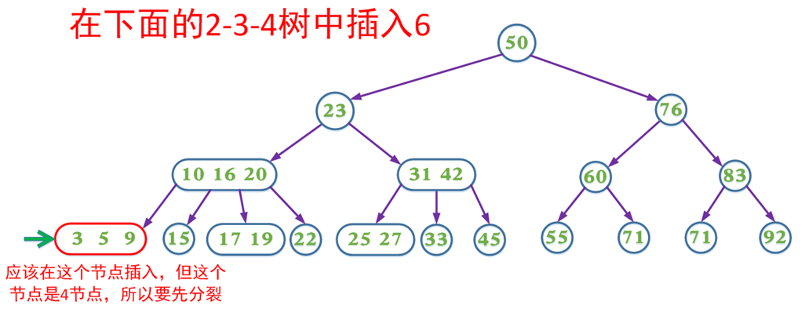   
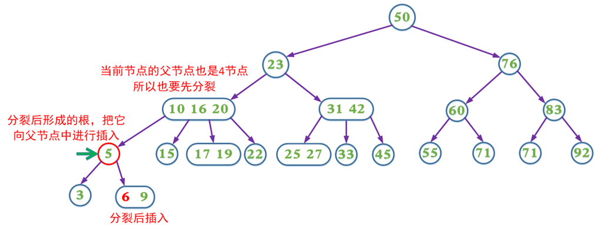  
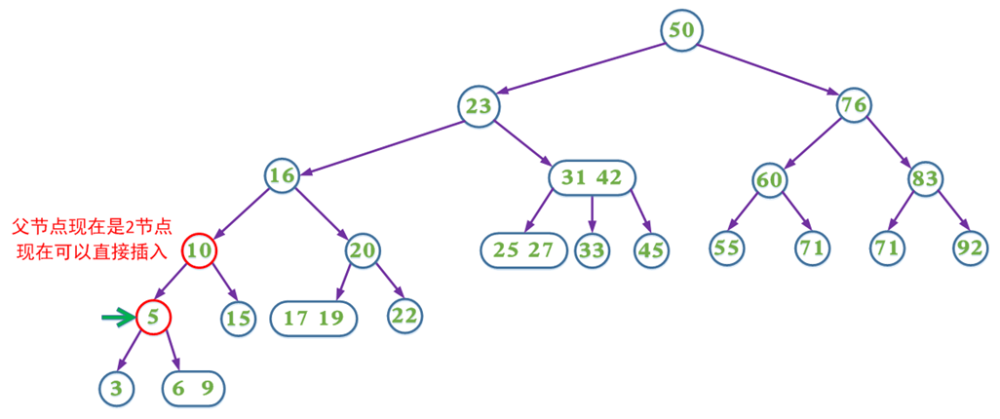  
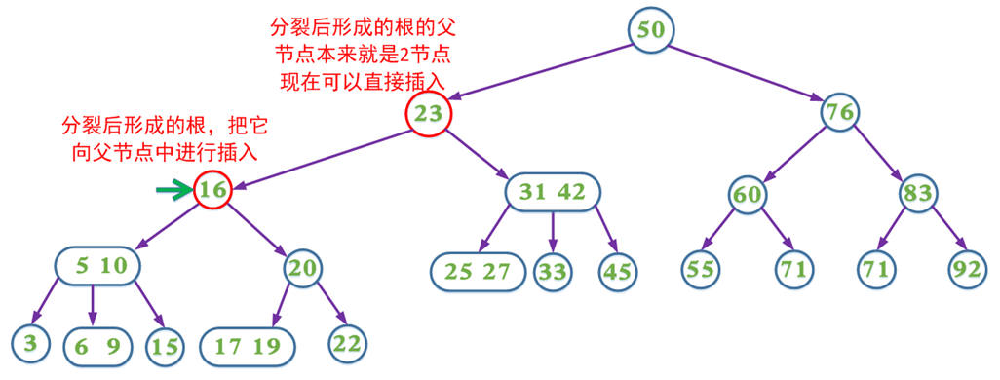  
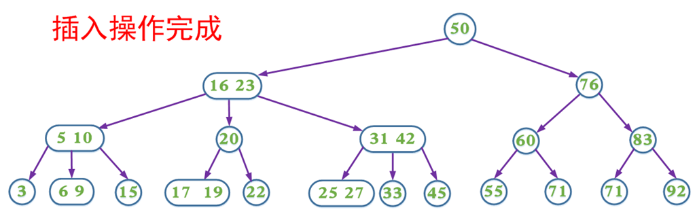  

* 删除:

```
1）如果2-3-4树中不存在当前需要删除的key，则删除失败。
（2）如果当前需要删除的key不位于叶子节点上，则用后继key覆盖，然后在它后继
key所在的子支中删除该后继key。
（3）如果当前需要删除的key位于叶子节点上:
       （3.1）该节点不是2节点，删除key，结束
       （3.2）该节点是2节点，删除该节点：
              （3.2.1）如果兄弟节点不是2节点，则父节点中的key下移到该节点，兄弟节点中的一个key上移
             （3.2.2）如果兄弟节点是2节点，父节点是个3节点或4节点，父节点中的key与兄弟节点合并
             （3.2.3）如果兄弟节点是2节点，父节点是个2节点，父节点中的key与兄弟节点中的key合并，形成一个3节点，把此节点看成当前节点（此节点实际上是下一层的节点），重复步骤3.2.1到3.2.3
   如果是在2节点（叶子节点）中进行删除，每次删除会减少一个分支，如果删除操作导致根节点参与合并，则2-3-4树会降低一层。
```

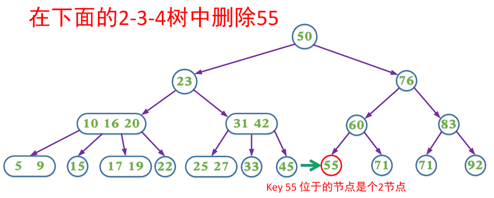  
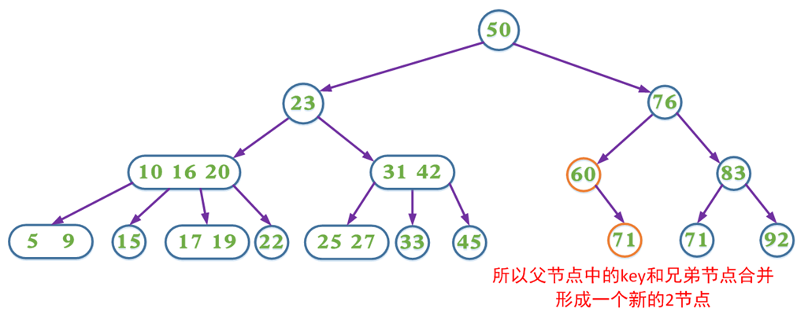  
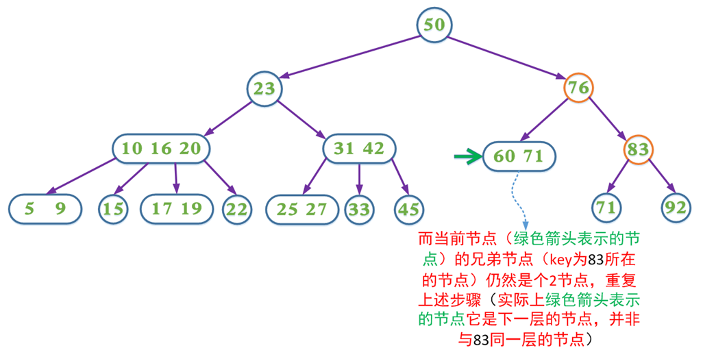  
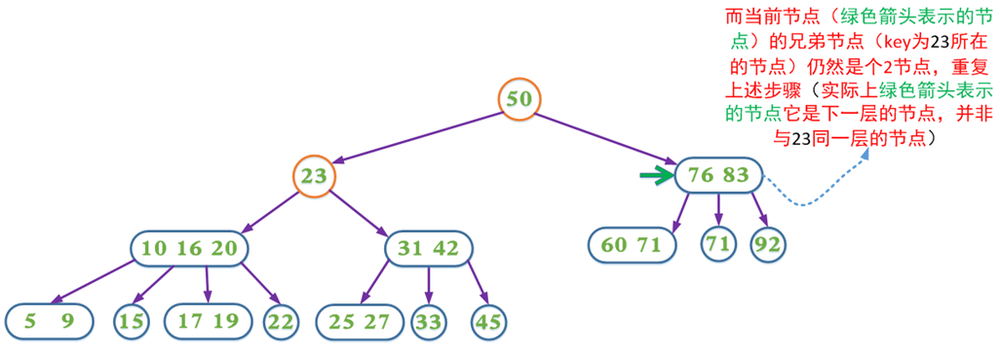  
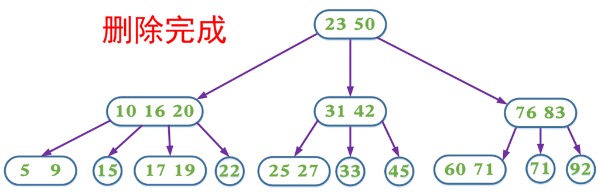  

“2-3-4树 与 红黑树的区别 该如何回答。”

          1. 概念性区别
          2.节点及数据规则区别
          3.所属范围问题
          4.效率问题
          5.转换关系问题


* B-树:  

一棵m阶的B-树或者是一棵空树，或者是满足下列要求的m叉树：  
树中的每个结点至多有m颗子树。  
若根结点不是叶子结点，则至少有两颗子树。  
除根结点外，所有非终端结点至少有[ m/2 ] ( 向上取整 )颗子树。  

* B-树插入:  
```
其实B-树的插入是很简单的，它主要是分为如下的两个步骤：

	1. 使用之前介绍的查找算法查找出关键字的插入位置，如果我们在B-树中查找到了关键字，则直接返回。

	2.然后，我就需要判断那个终端结点上的关键字数量是否满足：n<=m-1,如果满足的话，就直接在该终端结点上添加一个关键字，否则我们就需要产生结点的“分裂”。 分裂的方法是：生成一新结点。把原结点上的关键字和k（需要插入的值）按升序排序后，从中间位置把关键字（不包括中间位置的关键字）分成两部分。左部分所含关键字放在旧结点中，右部分所含关键字放在新结点中，中间位置的关键字连同新结点的存储位置插入到父结点中。如果父结点的关键字个数也超过（m-1），则要再分裂，再往上插。直至这个过程传到根结点为止。
```

假设这个B-树的阶为：3。树的初始化时如下：  
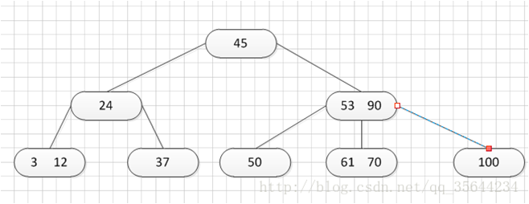 

需要插入一个关键字：30，可以得到如下的结果:  

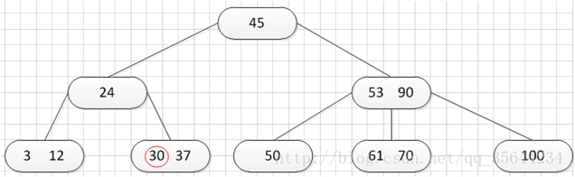 

再插入26，得到如下的结果:  

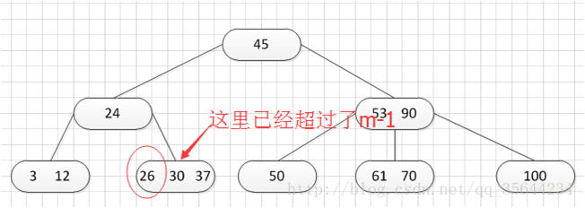  
此时如图所示，在插入的那个终端结点中，它的关键字数已经超过了m-1=2，所以我们需要对结点进分裂，所以我们先对关键字排序，得到：26 30 37 ，所以它的左部分为（不包括中间值）：26，中间值为：30，右部为：37，左部放在原来的结点，右部放入新的结点，而中间值则插入到父结点

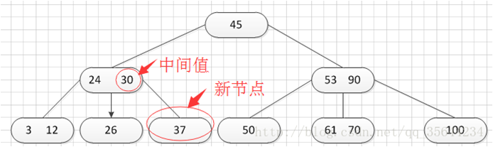  

然后继续插入新的关键字：85，得到如下图结果：  

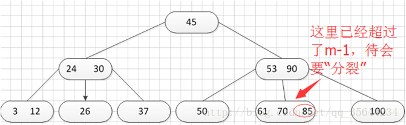    
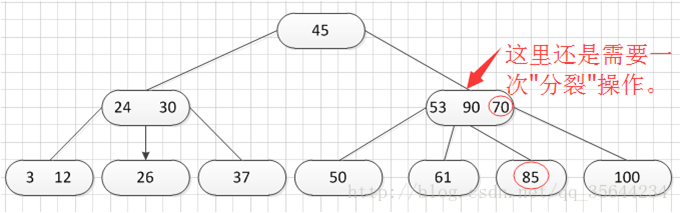   
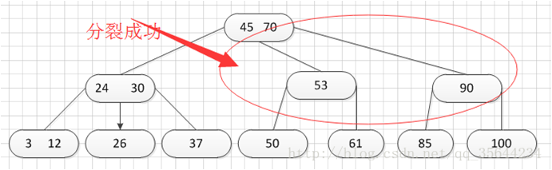   