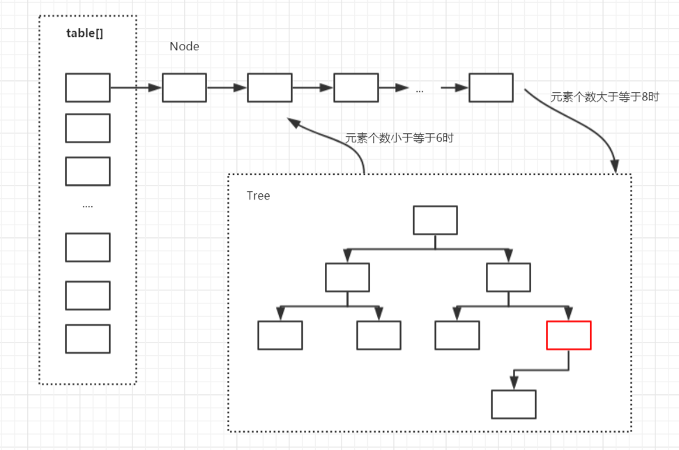

###differ Hash

* Java为数据结构中的映射定义了一个接口java.util.Map，它有四个实现类，分别是HashMap、HashTable、LinkedHashMap和TreeMap。  
关键技术剖析：  
```
Map用于存储键值对，根据键得到值，因此不允许键重复，值可以重复。
（1）HashMap是一个最常用的Map，它根据键的hashCode值存储数据，根据键可以直接获取它的值，具有很快的访问速度。HashMap最多只允许一条记录的键为null，不允许多条记录的值为null。HashMap不支持线程的同步，即任一时刻可以有多个线程同时写HashMap，可能会导致数据的不一致。如果需要同步，可以用Collections.synchronizedMap(HashMap map)方法使HashMap具有同步的能力。  
（2）Hashtable与HashMap类似，不同的是：它不允许记录的键或者值为空；它支持线程的同步，即任一时刻只有一个线程能写Hashtable，然而，这也导致了Hashtable在写入时会比较慢。  
（3）LinkedHashMap保存了记录的插入顺序，在用Iteraor遍历LinkedHashMap时，先得到的记录肯定是先插入的。在遍历的时候会比HashMap慢。有HashMap的全部特性。  
（4）TreeMap能够把它保存的记录根据键排序，默认是按升序排序，也可以指定排序的比较器。当用Iteraor遍历TreeMap时，得到的记录是排过序的。TreeMap的键和值都不能为空。
```


```
1.   HashMap允许有一个NULL(key) , 多个NULL(value);        HashTable 不允许键值为空

2.  HashMap提供containskey()和contiansvalue()方法来判断是否包含,HashTable提供了contains()来判断是否含有key=containskey();

         注： 由于hashmap允许为空，所以不能用get来判端是否含有某个key,只能用containskey来判断

3 .  HashMap 使用的是迭代  而 HashTable使用的是枚举，其中只有是否有下一个值和获取下一个值两个方法，不包括remove();

4.  扩容机制 HashMap 默认数组16  扩容为2的指数，   HashTable 默认数组为11,扩容为2*11+1；

5.  HashTable直接使用值的hashcode()值，HashMap需要对hashCode()进行抖动算法

HashMap和treeMap区别
Hashmap,hashtable用数组实现
TreeMap实现了SortMap接口，所以说treeMap是可以根据键排序的（需要自定义排序的话选择）,treemap底层为红黑树

HashMap和LinkHashMap区别
LinkHashMap，故名思意 ，由链表实现的，所以需要按输入顺序和输出顺序相同的话，就选择LinkhashMap;

HashMap和WeakHashMap区别
强弱引用的区别，hashmap强  ，weakhashmap为弱
```


* HashMap:

HashMap采用key/value的存储结构，每个可以对应一个唯一的value，查询和修改的速度很快，接近于O(1)的平均时间复杂度。他是线性安全的，且不能保证元素的顺序性。



HashMap采用了(数组 + 链表 + 红黑树)的实现结构，数组的一个元素称作位桶。在添加元素时，会根据key的hash值计算出元素在数组中的位置，如果该位置中没有元素，则直接把元素存储在此位置，如果该位置有元素了，则把元素以链表的形式存放在链表的尾部。当链表的元素个数达到一定的数量后(且数组的长度达到一定的长度))，则把链表转换为红黑树，从而提高效率。

```
查询过程：
1.计算key的hash值
2.找到key所在的桶及其第一个元素
3.如果第一个元素的key等于待查找的key，则直接返回
4.如果第一个元素为树节点，则按树的方式进行查找；否则按链表方式进行查找

HashMap的初始值还要考虑加载因子:
1.哈希冲突：若干Key的哈希值按数组大小取模后，如果落在同一个数组下标上，将组成一条Entry链，对Key的查找需要遍历Entry链上的每个元素执行equals()比较。
2.加载因子：为了降低哈希冲突的概率，默认当HashMap中的键值对达到数组大小的75%时，即会触发扩容。因此，如果预估容量是100，即需要设定100/0.75＝134的数组大小。
3.空间换时间：如果希望加快Key查找的时间，还可以进一步降低加载因子，加大初始大小，以降低哈希冲突的概率。

HashMap基于哈希思想:
1.实现对数据的读写。当我们将键值对传递给put()方法时，它调用键对象的hashCode()方法来计算hashcode，然后找到bucket位置来存储值对象。当获取对象时，通过键对象的equals()方法找到正确的键值对，然后返回值对象。
2.HashMap使用链表来解决碰撞问题，当发生碰撞时，对象将会储存在链表的下一个节点中。HashMap在每个链表节点中储存键值对对象。当两个不同的键对象的hashcode相同时，它们会储存在同一个bucket位置的链表中，可通过键对象的equals()方法来找到键值对。如果链表大小超过阈值（TREEIFY_THRESHOLD,8），链表就会被改造为树形结构。


总结：
1.HashMap是一种散列表，采用(数组+链表+红黑树)的存储结构
2.HashMap的默认初始值为16，装载因子为0.75f，总容量为2的n次方
3.HashMap扩容时每次容量变为原来的两倍
4.当桶的数量大于64且单个桶的数量大于8时，进行树化
5.当单个桶中元素的数量小于6时，进行反树化
6.hashMap是非线性安全的容器
7.HashMap添加查找元素的时间复杂度为O(1)
8.HashMap支持一个key为null值，多个value为null
```

* Hashtable:  
  


```
采用了(数组 + 链表 )的实现结构,HashTable并没有去继承AbstractMap，而是选择继承了Dictionary类，Dictionary是个被废弃的抽象类。
实现原理： 
成员变量跟HashMap基本类似，但是HashMap更加规范，HashMap内部还定义了一些常量，比如默认的负载因子，默认的容量，最大容量等。  
——HashTable的默认容量为11，默认负载因子为0.75。（HashMap默认容量是16，默认负载因子也是0.75）    
——HashTable的容量可以为任意整数，最小值为1，而HashMap的容量始终为2的n次方。    
——为避免扩容带来的性能问题，建议指定合理容量。跟HashMap一样，HashTable内部也有一个静态类叫Entry，其实是个键值对，保存了键和值的引用。也可以理解为一个单链表的节点，因为其持有下一个Entry对象的引用.  
——HashTable并不允许值和键为空，若为空，则抛出空指针异常。  
——HashMap计算索引的方式是h&(length-1)，而HashTable用的是模运算，效率上是低于HashMap的。  
——HashTable计算索引时将hash值先与上0x7fffffff，这是为了保证hash值始终为整数。  
——HashTable中若干方法都添加了synchronized关键字，也就意味着这个HashTable是个线程安全的类，这是它与HashMap最大的不同点。  
——HashTable每次扩容都是旧容量的2倍加2，而HashMap为旧容量的2倍。  
——Hashtable与HashMap另一个区别是HashMap的迭代器（Iterator）是fail-fast迭代器，而Hashtable的enumerator迭代器不是fail-fast的。所以当有其它线程改变了HashMap的结构（增加或者移除元素），将会抛出ConcurrentModificationException，但迭代器本身的remove()方法移除元素则不会抛出ConcurrentModificationException异常
```
