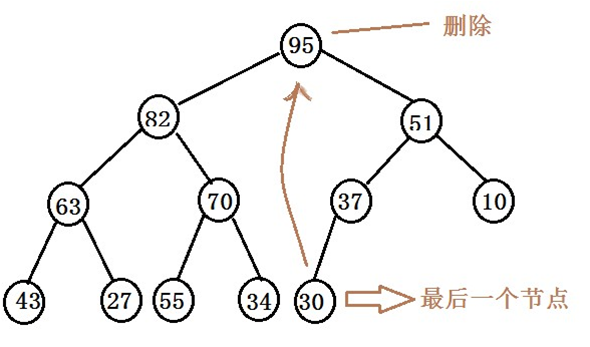
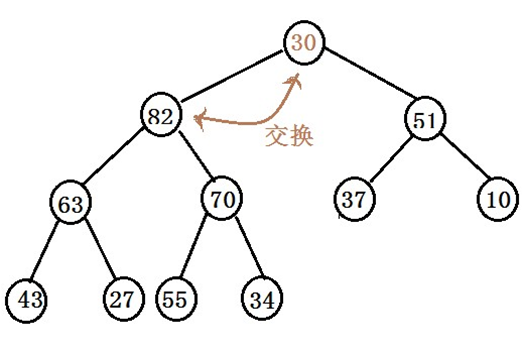
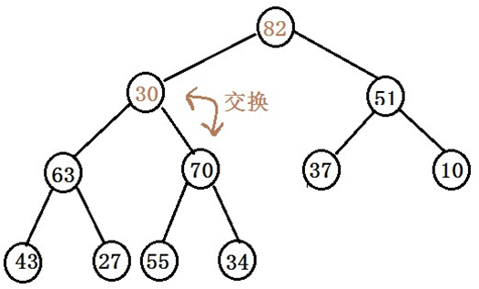
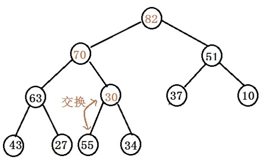
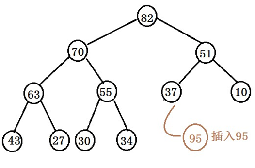
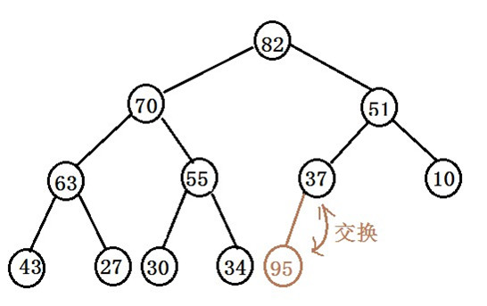
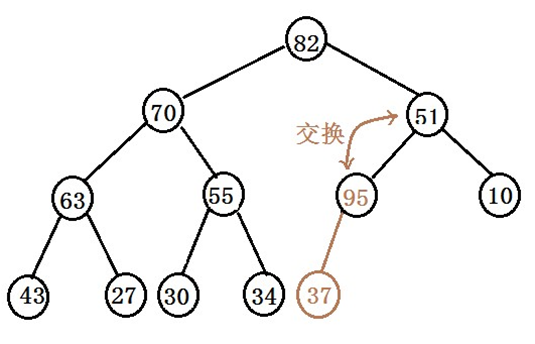
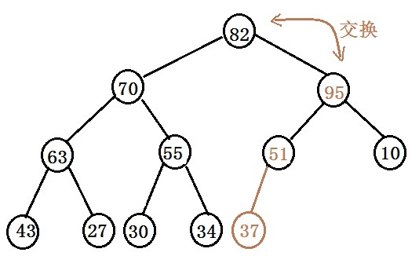
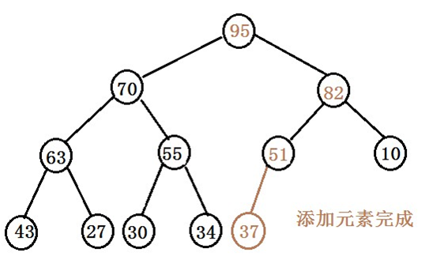

###heap 堆

* 堆是一个有特殊特点的二叉树。堆是一种树，由它实现的优先级队列的插入和删除的时间复杂度都是O(logn)，用堆实现的优先级队列虽然和数组实现相比较删除慢了些，但插入的时间快的多了。当速度很重要且有很多插入操作时，可以选择堆来实现优先级队列:  

1.它是一颗完全二叉树。也就是说，除了树的最后一层节点不需要是满的，其他的每一层从左到右都完全是满的  
2.它常常用一个数组实现。  
3.堆中的每一个节点都满足堆的条件，也就是说每一个节点的关键字都大于或者等于这个节点的子节点的关键字（堆顶最大，就是我们所说的大顶堆，也成为最大堆）。

* 这里要注意堆和前面说的二叉搜索树的区别，二叉搜索树中所有节点的左子节点关键字都小于右子节点关键字，在二叉搜索树中通过一个简单的算法就可以按序遍历节点。但是在堆中，按序遍历节点是很困难的，堆只有沿着从根节点到叶子节点的每一条路径是降序排列的，指定节点的左边节点或者右边节点，以及上层节点或者下层节点由于不在同一条路径上，他们的关键字可能比指定节点大或者小。所以相对于二叉搜索树，堆是弱序的。

* 前面我们说了，堆是弱序的，所以想要遍历堆是很困难的，基本上，堆是不支持遍历的。对于查找，由于堆的特性，在查找的过程中，没有足够的信息来决定选择通过节点的两个子节点中的哪一个来选择走向下一层，所以也很难在堆中查找到某个关键字。因此，堆这种组织似乎非常接近无序，不过，对于快速的移除最大（或最小）节点，也就是根节点，以及能快速插入新的节点，这两个操作就足够了

* 移除是指删除关键字最大的节点（或最小），也就是根节点。根节点在数组中的索引总是0，即maxNode = heapArray[0];移除根节点之后，那树就空了一个根节点，也就是数组有了一个空的数据单元，这个空单元我们必须填上。第一种方法：将数组所有数据项都向前移动一个单元，这比较费时。第二种方法：  
　　　　①、移走根  
　　　　②、把最后一个节点移动到根的位置  
　　　　③、一直向下筛选这个节点，直到它在一个大于它的节点之下，小于它的节点之上为止

删除堆根部95  
  
  
  
  

* 插入节点也很容易，插入时，选择向上筛选，节点初始时插入到数组最后第一个空着的单元，数组容量大小增一。然后进行向上筛选的算法。   
　　注意：向上筛选和向下不同，向上筛选只用和一个父节点进行比较，比父节点小就停止筛选了

插入95  
  
  
  
  
  

|总结|
|----|
|堆是优先级队列ADT的有效实现形式|
|堆提供移除最大数据项和插入的方法，时间复杂度均为O(logN)|
|最大数据项总是在根的位置上|
|堆不能有序的遍历所有数据，不能找到特定关键字数据项的位置，也不能移除特定关键字的数据项|
|堆通常用数组实现，表现为一颗完全二叉树。根节点的下标为0，最后一个节点的下标为N-1|
|每个节点的关键字都小于它的父节点，大于它的子节点|
|堆的插入算法|
|堆的删除算法|

